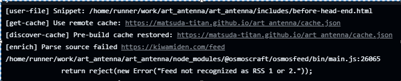

# About
アート系情報のうち、テクニカルな要素を取り上げているサイトやブログの更新をひとまとめに見れるhtmlを出力するプロジェクト。

## 編集の仕方
- サイト追加したいとき  
osmosfeed.yamlにrssのURLを張る
- 更新時刻いじりたいとき  
.github/workflows/update-feed.yaml

This is repository hosts the UI and content of an RSS feed reader.

### ビルドエラーがあったとき
アクションのワークフローの実行結果からここを見るとエラーがあったサイトがわかる

## Links and references

- [How does it work?](https://github.com/osmoscraft/osmosfeed#osmosfeed)
- [File an issue about the template](https://github.com/osmoscraft/osmosfeed-template)
- [File an issue about the tool](https://github.com/osmoscraft/osmosfeed)
- [Lastest documentation](https://github.com/osmoscraft/osmosfeed)
